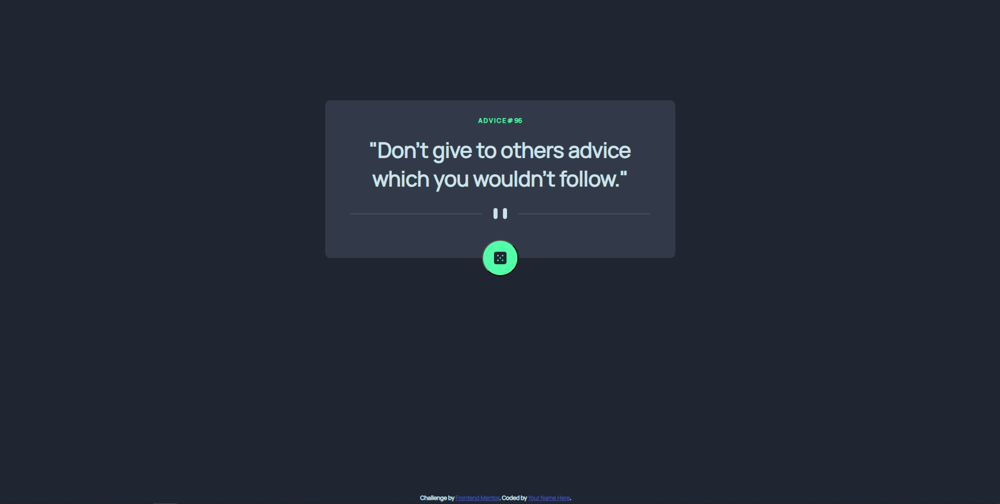
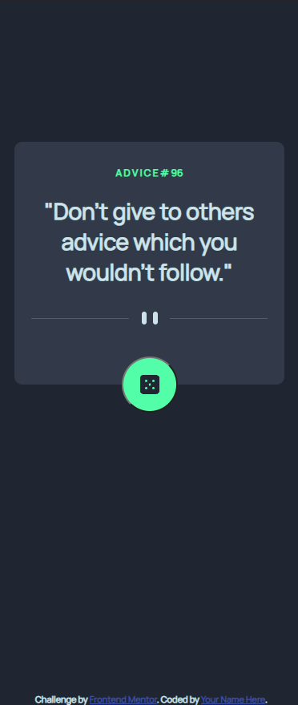

# Frontend Mentor - Advice generator app

This is a solution to the [Advice Generator App](https://www.frontendmentor.io/challenges/advice-generator-app-QdUG-13db). Frontend Mentor challenges help you improve your coding skills by building realistic projects. 
## Table of contents

- [Overview](#overview)
  - [Screenshot](#screenshot)
  - [Links](#links)
- [My process](#my-process)
  - [Built with](#built-with)
  - [What I learned](#what-i-learned)
  - [Continued development](#continued-development)
  - [Useful resources](#useful-resources)
- [Author](#author)
- [Acknowledgments](#acknowledgments)

## Overview
This repository contains my personal solution for [Advice Generator App](https://www.frontendmentor.io/challenges/advice-generator-app-QdUG-13db).

If there's any input/advice/recommendation that you want to add. Please send your comment in the issues tab.

Thank you! 🙏

### Screenshot

Desktop Screenshot:

Mobile Screenshot:

### Links

- Solution URL: [GitHub Solution URL here](https://github.com/farrel-hi/frontend-mentor-advice-generator-app-main)
- Live Site URL: [Live site URL here](https://farrel-hi.github.io/frontend-mentor-advice-generator-app-main/)

## My process
1. Create the HTML semantic structure first
2. Create the mobile rules first and then the desktop rules second using CSS
3. Create the function for generating random Advice everytime dice icon is clicked using JavaScript

### Built with

- Semantic HTML5 markup
- CSS custom properties
- JavaScript Function & DOM
- Flexbox
- [Glow Effect](https://cssbud.com/css-generator/css-glow-generator/) - For styles
- [Advice Generator API](https://api.adviceslip.com/)

### What I learned

Here are the things that i learn:
1. Relearn and practice function in Javascript
2. Practices my CSS design
3. Learn how to use advice generator API

### Continued development

I would like to continue develop my skill as a whole through projects from [Frontend Mentor](https://www.frontendmentor.io/).

### Useful resources

- [W3School](https://www.w3schools.com/)
- [HTML Documentation](https://developer.mozilla.org/en-US/docs/Web/HTML)

## Author

- Frontend Mentor - [@farrel-hi](https://www.frontendmentor.io/profile/farrel-hi)

## Acknowledgments
